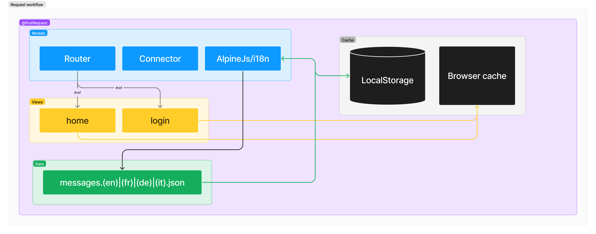

# PlaneStore

## Description

This project is designed to sell planes and the main features are selling planes on the internet.

## Getting Started

### Built With

* Data storage:
  * [![GoogleSheets]][GoogleSheets-url]
* DataBase Engine:
  * [![GCP]][GCP-url]
* IDE used:
  * [![Phpstrom]][Phpstrom-url]
  * [![VSC]][VSC-url]
* Package manager:
  * [![NPM]][NPM-url]
* OS:
  * [![MacOS]][MacOS-url]
  * [![Windows]][Windows-url]
* Runtime:
  * [![Nodejs]][Nodejs-url]
* Testing:
  * [![Jest]][Jest-url]
* Development server:
  * [![Vite]][Vite-url]

### Prerequisites

Those are the prerequisites to run the project. All the versions are the ones used to develop the project. It could work with other versions but it is not guaranteed.

* Package manager:
  * [![NPM]][NPM-url]
* Runtime:
  * [![Nodejs]][Nodejs-url]

### Configuration

How to set up the database?
How do you set the sensitive data?

## Deployment

### On dev environment

There are two folder to run the application. You can either run the login or the home page.

Follow below steps in the `login` or `main` folder to run this page.

#### Install the dependencies

Using npm install the dependencies.

```shell
npm install
```

#### Run the application

The following command will start the dev server via Vite.

```shell
npm run dev
```

### On integration environment

There are no procedures to deploy the application on the integration environment.

## Directory structure

```shell
├───doc
└───src
    ├───css
    │   ├───abstracts
    │   ├───base
    │   ├───components
    │   ├───custom
    │   └───layout
    ├───home
    ├───img
    ├───login
    ├───public
    └───test
        ├───authentication
        └───localization
```

## Documentation

### Architecture


### Request workflow



## Collaborate

### Convention

#### Commit

The project uses [Conventional Commits][Commit-url]. The keywords used are: `feat`, `fix`, `chore`, `refactor`, `test`, `docs`. The commits are named with the following pattern: `type: description` eg.(feat: add login page).

#### Workflow

The project uses [Gitflow][GitFlow-url]. The branches used are: `main`, `develop`, `feature`, `release`, `hotfix`. The branches are named with the following pattern: `type/short-description` eg.(feature/ux-reservation).

#### file naming

The project uses the following file naming convention.

| Type | Naming convention | Example             |
|------|-------------------|---------------------|
| CSS  | kebab-case        | `main.css`          |
| HTML | kebab-case        | `login-page.html`   |
| JS   | camelCase         | `loginPage.js`      |
| Class| PascalCase        | `LoginPage`         |
| Tests | camelCase        | `loginPage.test.js` |
| Translations | camelCase | `loginPage.en.js`   |

### Versioning

The project uses [SemVer][SemVer-url]. The versioning is done with the following pattern: `major.minor.patch` eg.(1.0.0).

### Testing

The project uses [Jest][Jest-url] for testing.

### Development server

The project uses [Vite][Vite-url] as a development server.

## Wiki

Our wiki can be found at [planes-store/wiki]([planes-store/wiki](https://github.com/CPNV-RIA1/planes-store/wiki))

## License

This project is not licensed yet.

## Contact

### Dimitri RUTZ

* [Email](mailto:dimitri.rutz@eduvaud.ch)

### Benjamin FONTANA

* [Email](mailto:benjamin.fontana@eduvaud.ch)

[GCP]: https://img.shields.io/badge/Google%20Cloud%20Platform-20232A?style=for-the-badge&logo=google-cloud&logoColor=google-cloud
[GCP-url]: https://cloud.google.com/
[GoogleSheets]: https://img.shields.io/badge/Google%20Sheets-20232A?style=for-the-badge&logo=google-sheets&logoColor=google-sheets
[GoogleSheets-url]: https://www.google.com/sheets/about/
[Phpstrom]: https://img.shields.io/badge/PhpStorm%202023.3.4-20232A?style=for-the-badge&logo=phpstorm&logoColor=phpstorm
[Phpstrom-url]: https://www.jetbrains.com/phpstorm/
[VSC]: https://img.shields.io/badge/Visual%20Studio%20Code%201.86.2-20232A?style=for-the-badge&logo=visual-studio-code&logoColor=007ACC
[VSC-url]: https://code.visualstudio.com/
[NPM]: https://img.shields.io/badge/npm%2010.4.0-20232A?style=for-the-badge&logo=npm&logoColor=npm
[NPM-url]: https://www.npmjs.com/
[MacOS]: https://img.shields.io/badge/macOS%20Sonoma-20232A?style=for-the-badge&logo=apple&logoColor=apple
[MacOS-url]: https://www.apple.com/
[Windows]: https://img.shields.io/badge/Windows%2011-20232A?style=for-the-badge&logo=windows&logoColor=0078D4
[Windows-url]: https://www.microsoft.com/
[Nodejs]: https://img.shields.io/badge/Node.js%2020.11-20232A?style=for-the-badge&logo=node.js&logoColor=node.js
[Nodejs-url]: https://nodejs.org/en/
[Jest]: https://img.shields.io/badge/Jest-20232A?style=for-the-badge&logo=jest&logoColor=jest
[Jest-url]: https://jestjs.io/
[Vite]: https://img.shields.io/badge/Vite-20232A?style=for-the-badge&logo=vite&logoColor=vite
[Vite-url]: https://vitejs.dev/
[GitFlow-url]: https://www.atlassian.com/git/tutorials/comparing-workflows/gitflow-workflow
[SemVer-url]: https://semver.org/
[Commit-url]: https://www.conventionalcommits.org/
